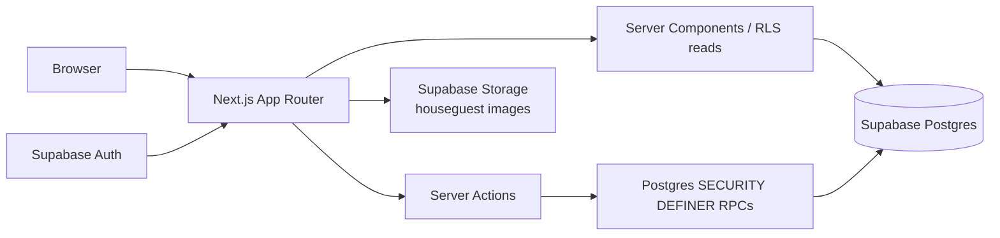

# HouseDraft

**Draft the house. Win eviction night.**

Fantasy leagues for Big Brother–style reality competition seasons — snake-draft the cast, score every twist, trade for a backdoor, and crown a league champion on finale night.

---

## Overview

Reality-TV fans already argue about HOH winners, veto plays, and blindsides all season long — but most “fantasy” setups are spreadsheets, group chats, or season-specific one-offs. **HouseDraft** turns that energy into a real product: create a league with friends, draft houseguests into rosters, let a commissioner score episode events as they happen, and watch a live leaderboard through finale night.

Built for friends who watch together, commissioners who want clean scoring without spreadsheet chaos, and anyone who wants season-long stakes beyond “who wins the show.”

---

## Highlights

- **Full season loop in one app** — invite → snake draft → weekly scoring → trades → predictions → finale bonuses → champion.
- **Database-backed game integrity** — draft picks, trades, and scoring run through Postgres RPCs with row-level security; concurrent picks can’t double-fire.
- **Ownership-aware scoring** — points credit whoever owned the houseguest *when the event happened*, so trades don’t rewrite history.
- **Season-ready scoring model** — twist types evolve with the show (HOH, veto, diamond veto, Time Capsule, Block Buster, Medieval Round, and more).
- **Ship-ready stack** — Next.js App Router + Supabase Auth/Postgres/Storage; deployable on Vercel with only public URL + anon key.

---

## Features

### Leagues & seasons
- Create or join leagues by invite code (joins lock once the draft starts)
- Attach leagues to a shared season + cast (houseguest photos, bios, status)
- Commissioner controls: draft order, scoring, cast status, settings, finale

### Snake draft
- Live draft room with snake order and “on the clock” clarity
- Concurrent pick safety via row locks in Postgres
- Polling refresh (~2.5s) so every team sees the board update without extra infra

### Scoring & leaderboard
- Commissioner enters episode events (HOH, veto, nominations, evictions, twist outcomes…)
- Points auto-fill from league scoring rules and are snapshotted at entry time
- Leaderboard + weekly columns + “Diary Room Receipts” event log
- Undo by deleting a mis-entered event — standings correct immediately

### Predictions & finale
- Pre-draft (or pre-lock) picks for season winner + first boot
- Finale scoring plus prediction bonuses; crown rank-1 as league champion

### Trades
- 1-for-1 roster swaps with optional commissioner approval (“Backdoor complete”)
- Claim leftover / unclaimed houseguests via commissioner-gated pool trades
- Post-trade points follow the new owner from that moment forward

### Auth & access
- Email/password auth via Supabase
- League pages membership-gated; RLS is the real security boundary

---

## Quick Start

**Prerequisites:** Node.js 20+, a [Supabase](https://supabase.com) project, npm.

```bash
npm install
cp .env.example .env.local   # or create .env.local with the vars below
npm run dev                  # http://localhost:3000
```

Apply migrations from `supabase/migrations/` (CLI `supabase db push` or SQL editor, in filename order). Optionally seed demo data:

```bash
npm run seed                 # requires SUPABASE_SERVICE_ROLE_KEY (local only)
```

Other scripts:

| Script | What it does |
| --- | --- |
| `npm run dev` | Next.js dev server |
| `npm run build` / `npm start` | Production build + serve |
| `npm run lint` | ESLint |
| `npm run seed` | Seed BB28-style demo season, users, and league |
| `npm run test:e2e` | API-level regression across draft / scoring / trades / finale |

---

## Stack

| Layer | Choice |
| --- | --- |
| Framework | **Next.js 16** (App Router) + **React 19** + **TypeScript** |
| Styling | **Tailwind CSS v4**, shadcn/Radix UI, custom “stage lighting” theme |
| Backend | **Supabase** — Auth (`@supabase/ssr`), Postgres, Storage |
| Data access | Server Components + Server Actions wrapping Postgres RPCs |
| Deploy target | **Vercel**-ready (env: public Supabase URL + anon key only) |

---

## Architecture



**Design choices that matter:**

1. **RLS first** — the app ships only the anon key; membership and commissioner checks are enforced in the database.
2. **Mutations are RPCs** — `create_league`, `make_draft_pick`, trade lifecycle, `add_scoring_event`, `award_finale_bonuses`, etc. Race-prone paths (draft picks, trade execute) are serialized/validated in SQL.
3. **No stored totals** — `rosters` are ownership *intervals* (`acquired_at` / `released_at`). Views (`league_leaderboard`, `member_scoring_events`, `weekly_scores`) attribute each event to the owner at `occurred_at`.
4. **Thin app layer** — `lib/actions/*` parse forms, call RPCs, map error codes to friendly copy, and revalidate paths.
5. **Draft liveness without websockets** — `Poller` refreshes the draft room on an interval; Realtime is the natural upgrade path.

```
app/(auth)/                 login, signup
app/(app)/dashboard         my leagues
app/(app)/leagues/          new · join · [id]/{draft,leaderboard,roster,trades,predictions,commissioner}
app/(app)/seasons/          cast manager + photo uploads
lib/actions/                auth, leagues, draft, scoring, trades, predictions, seasons
lib/supabase/               browser / server / middleware clients
supabase/migrations/        enums → tables → RLS → RPCs → views → storage (+ season scoring updates)
```

---

## Configuration

Create `.env.local` (there is no committed secrets file — use placeholders):

| Variable | Used by | Notes |
| --- | --- | --- |
| `NEXT_PUBLIC_SUPABASE_URL` | Client + server | Supabase project URL |
| `NEXT_PUBLIC_SUPABASE_ANON_KEY` | Client + server | Publishable/anon key (RLS is the boundary) |
| `SUPABASE_SERVICE_ROLE_KEY` | `npm run seed` only | **Never** ship to the client or Vercel |

For a fresh Supabase project: run migrations in order, then disable Auth email confirmation if you want instant signup (the app handles either mode).

**Vercel:** set only `NEXT_PUBLIC_SUPABASE_URL` and `NEXT_PUBLIC_SUPABASE_ANON_KEY`.

---

## Usage

**1. Start a league**  
Sign up → create a season/cast (or reuse one) → create a league → share the invite code → friends join with team names.

**2. Draft & play the season**  
Commissioner sets order / randomizes and starts the snake draft → teams pick live → commissioner scores weekly events → members propose 1-for-1 (and leftover-pool) trades → leaderboard updates from Diary Room receipts.

**3. Finale night**  
Lock/score finale placements and events → award prediction bonuses → champion banner on league home + leaderboard.

**Local demo path:** after `npm run seed`, use the seeded demo accounts documented in `TESTING.md` to walk draft → scoring → trades → finale in ~5–40 minutes (or run `npm run test:e2e` for the API regression).

---

## Project status

Actively developed through the Big Brother 28 season window (initial commit July 2026; ongoing scoring-rule and trade updates into September 2026). Core league loop is feature-complete for private playtesting; public launch polish (hosted demo URL, screenshots, license) is still open.

**Known limitations (honest):** draft room uses polling (not Realtime); trades are 1-for-1 only; single commissioner per league; no email notifications or payments (by design).

---

## Disclaimer

HouseDraft is a fan-made fantasy product and is **not affiliated with** any television network or reality franchise.
